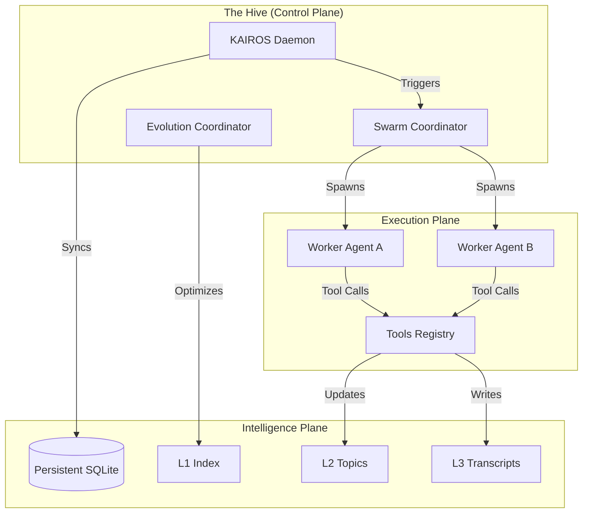
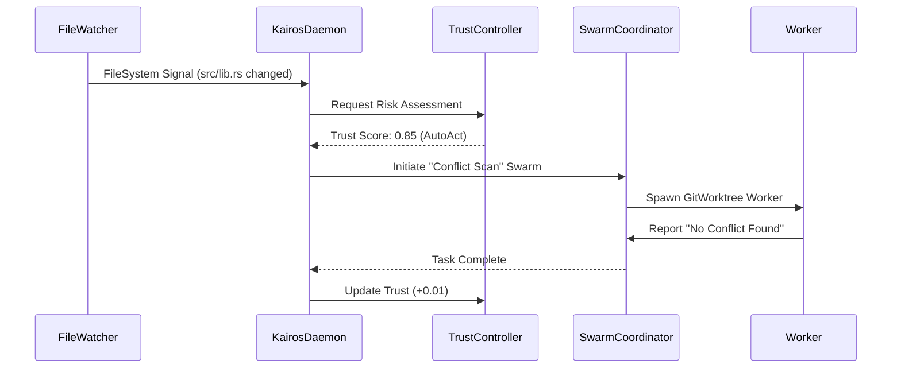

# DreamSwarm Architecture: The Kinetic Engine

This document provides a deep-dive into the internals of the DreamSwarm autonomous platform. It is intended for core contributors and architects looking to understand the interplay between cognitive memory, background daemons, and parallel orchestration.

---

## 🏛 High-Level Topology

DreamSwarm is architected as a **Kinetic AI Real-time Operational System (KAIROS)**. Unlike traditional CLI tools that wait for user commands, KAIROS is designed for proactive autonomy.

---

## 🧠 Cognitive Memory Architecture

DreamSwarm uses a **Bio-mimetic Tiered Memory** system to manage multi-gigabyte codebases without overwhelming the LLM's context window.

### 1. Layer 1 (L1): The Semantic Index
*   **Purpose**: Immediate situational awareness.
*   **Content**: High-level map of the codebase, project rules, and recently resolved issues.
*   **Mechanism**: Compressed JSON format, always injected into the system prompt.

### 2. Layer 2 (L2): Just-In-Time Topic Files
*   **Purpose**: Expert-level knowledge on demand.
*   **Content**: Detailed function signatures, implementation notes, and dependency graphs.
*   **Mechanism**: Latent retrieval. When the agent discusses "authentication," the coordinator pulls `auth.md` into context.

### 3. Layer 3 (L3): Long-Term Transcripts
*   **Purpose**: Historical tracing and learning.
*   **Content**: Full history of all agent/user interactions and tool outputs.
*   **Mechanism**: Append-only log files used by the `autoDream` engine to synthesize new L1/L2 knowledge during sleep cycles.

---

## 🕒 KAIROS Heartbeat Loop

The KAIROS daemon runs an asynchronous loop that processes internal and external signals.

---

## 🕸 Parallel Orchestration (Phase 11)

DreamSwarm implements a **Mega-Workspace** strategy for multi-repository tasks.

### The Worktree Isolation Pattern
When a swarm is initiated across multiple linked repositories, the `WorktreeExecutor`:
1.  Creates a unique root directory in `.dreamswarm-worktrees/`.
2.  Executes `git worktree add` for the **primary** repository.
3.  Executes `git worktree add` for all **linked** repositories side-by-side.
4.  Standardizes the environment so relative paths just work.

### Predictive Conflict Resolution (Phase 14)
The `FileWatcher` maintains a hash-map of current file states across all active `dreamswarm/*` branches. If two agents are assigned tasks that modify the same line-range of a file in different worktrees, the daemon issues a pre-emptive **Conflict Event** before the merge ever occurs.

---

## 🛡 Security: The 5-Layer Permission Gate

DreamSwarm operates with a restrictive security model:
1.  **Mode Check**: Is the agent in `Autonomous` or `AskFirst` mode?
2.  **Deny List**: Blocked commands (e.g., `rm -rf /`, `curl` to internal metadata).
3.  **Allow List**: Pre-approved scripts and tools.
4.  **Risk Scoring**: Does this change affect critical infra?
5.  **User Approval**: The final human-in-the-loop gate for High-Risk actions.

---

## 🧬 Neural Evolution System

The `EvolutionCoordinator` runs in the background to refine the agent's effectiveness:
1.  **Extraction**: Pulls successful "interaction patterns" from L3 Transcripts.
2.  **Synthesis**: Uses a high-reasoning model (Claude Opus/Sonnet) to generate variants of successful prompts.
3.  **Deployment**: Replaces outdated system prompts with "Challenger" variants that have higher success probabilities.
