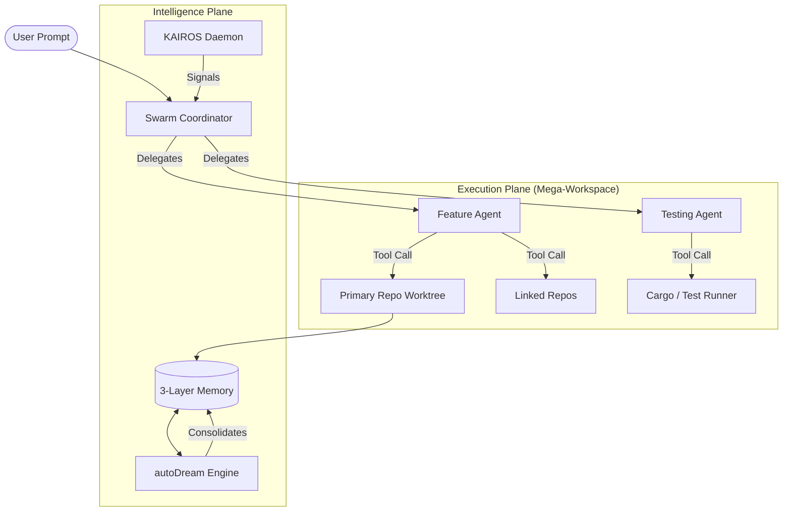

<p align="center">
  
</p>

# DreamSwarm 🐝
### The Autonomous, Multi-Agent Orchestration Engine for Software Engineering
**State-of-the-Art • Self-Healing • Multi-Repo • Neural-Evolving**

[](https://github.com/dreamswarm/dreamswarm/stargazers)
[](https://github.com/dreamswarm/dreamswarm/network/members)
[](LICENSE)
[](https://www.rust-lang.org/)
[](#)

---

## 📖 Overview

DreamSwarm is not just a coding assistant; it is a **persistent, autonomous hive-mind** designed to manage complex software ecosystems. Built in Rust for maximum safety and performance, DreamSwarm operates as a background daemon (KAIROS) that observes your environment, identifies engineering debt, and deploys specialized swarms to solve problems before you even notice them.

> **"DreamSwarm transforms the local developer workspace into a managed, autonomous engineering hub."**

---

## 🧭 Table of Contents
- [✨ Core Pillars](#-core-pillars)
- [🏗 Architecture](#-architecture)
- [🚀 Quick Start](#-quick-start)
- [🛠 Commands](#-commands)
- [📡 The Oracle API](#-the-oracle-api)
- [🛡 Security & Safety](#-security--safety)
- [🚧 Roadmap (14 Phases)](#-roadmap-14-phases)
- [🤝 Contributing](#-contributing)
- [📝 License](#-license)

---

## ✨ Core Pillars

### 🧠 3-Layer Memory & autoDream
DreamSwarm utilizes a revolutionary **3-layer memory architecture** that mimics biological consolidation:
- **Layer 1 (L1) - Memory Index**: High-speed, compressed pointers to core architectural facts. Always context-resident.
- **Layer 2 (L2) - Topic Files**: Granular technical details on modules, features, or bugs. Loaded JIT via vector search.
- **Layer 3 (L3) - Session Transcripts**: Raw logs of every interaction, archived for background learning.
- **autoDream Engine**: An autonomous background process that performs "Sleep Cycles" for your code—consolidating facts, pruning noise, and resolving contradictions while you sleep.

### 🕒 KAIROS Background Daemon
**Kinetic AI Real-time Operational System (KAIROS)** is the engine's heartbeat:
- **Proactive Initiative**: KAIROS monitors git activity and filesystem changes. If a bug is detected or a test is missing, it initiates a task autonomously.
- **Trust-Based Autonomy**: Operates on a dynamic trust scale. As the system proves its competence, it graduates from "Ask First" to "Autonomous Act".

### 🐝 Swarm Orchestration
Scale your output by deploying multiple specialized agents in parallel:
- **Worktree Isolation**: Agents spin up temporary git worktrees to develop features in parallel without touching your working directory.
- **Mailbox Pattern**: Asynchronous communication between agents allows for complex review loops and consensus-based decisions.

---

## 🏗 Architecture



---

## 🚀 Quick Start

### Installation

```bash
# Clone the repository
git clone https://github.com/dreamswarm/dreamswarm.git
cd dreamswarm

# Build and Install
cargo install --path .
```

### Initial Setup

```bash
# Initialize the DreamSwarm environment
dreamswarm init

# Start the KAIROS Background Daemon
dreamswarm daemon start
```

---

## 🛠 Commands

| Command | Action |
| :--- | :--- |
| `dreamswarm chat` | Start an interactive session with the Swarm Lead. |
| `dreamswarm swarm run` | Deploy a parallel multi-agent swarm for a complex task. |
| `dreamswarm daemon run` | Run the KAIROS heart in the foreground for debugging. |
| `dreamswarm memory audit` | Inspect the 3-layer memory index and health. |
| `dreamswarm api start` | Force start "The Oracle" REST API on a specific port. |

---

## 📡 The Oracle API

DreamSwarm exposes a high-performance REST API (default port `8080`) for external monitoring and control:

- **GET `/consensus`**: View the current hive state and trust index.
- **GET `/api/v1/telemetry/stream`**: Real-time SSE stream of swarm activity.
- **POST `/api/v1/control/war-room`**: Initiate high-intensity stress diagnostics.
- **POST `/api/v1/control/stop`**: Emergency broadcast to stop all active swarms.

---

## 🛡 Security & Safety

DreamSwarm is built on a **Security-First** foundation:
- **5-Layer Permission Gate**: Tool execution is evaluated based on Mode, Deny-lists, Allow-lists, Risk Scoring, and final User Approval.
- **Sandboxed Consolidation**: Memory pruning and background analysis never touch source files directly; they operate in restricted buffers.
- **Immutable Audit Logs**: Every autonomous action is signed and recorded in an immutable JSONL log.

---

## 🚧 Roadmap (14 Phases)

DreamSwarm is evolving through 14 distinct architectural phases:

- [x] **Phase 1-4**: Core Loop, Memory, Persistence & Tool Layer.
- [x] **Phase 5**: Swarm Coordinator & Multi-Agent Logic.
- [x] **Phase 6**: "The Oracle" REST API & Dashboard.
- [x] **Phase 7-9**: Resilience, Warm-Start, and Self-Healing.
- [x] **Phase 10-11**: Control Signals & Multi-Repo Orchestration.
- [x] **Phase 12**: Neural Evolution & Self-Prompting.
- [ ] **Phase 13**: P2P Distributed Consensus (The HiveMind).
- [x] **Phase 14**: Predictive Conflict Resolution.

---

## 🤝 Contributing

We welcome contributions of all kinds! Whether you are implementing new tools, refining prompts, or hardening the daemon, please see our **[CONTRIBUTING.md](CONTRIBUTING.md)** for detailed dev setup and standards.

---

## 📝 License

DreamSwarm is open-source software licensed under the **Apache License, Version 2.0**.
