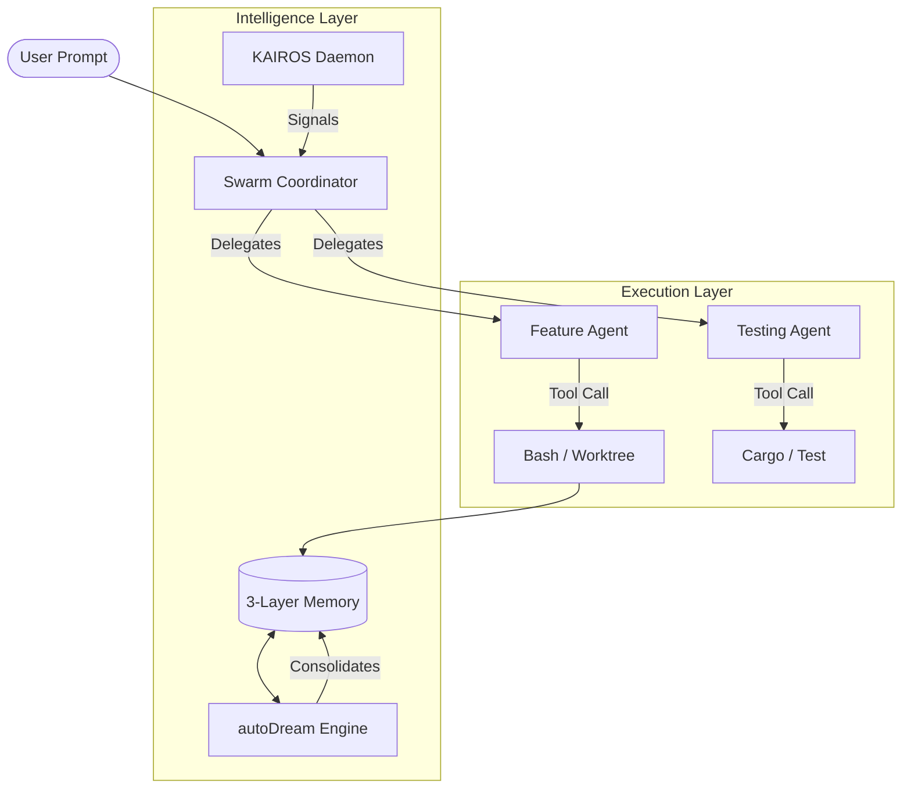

<p align="center">
  
</p>

# DreamSwarm 🐝
**The Intelligent, Autonomous, Multi-Agent Swarm for Software Engineering.**

DreamSwarm is a state-of-the-art autonomous platform designed to solve complex software engineering tasks through swarm intelligence. Unlike simple coding assistants, DreamSwarm operates as a persistent, self-healing ecosystem that manages its own memory, orchestrates multiple specialized agents in parallel, and proactively maintains codebases in the background.

[](LICENSE)
[](https://github.com/dreamswarm/dreamswarm/commits/main)
[](CONTRIBUTING.md)
[](SECURITY.md)

---

## ✨ Core Pillars of Swarm Intelligence

### 🧠 3-Layer Memory & autoDream
DreamSwarm utilizes a revolutionary **3-layer memory architecture** that mimics biological consolidation.
- **Layer 1: Memory Index**: Highly compressed pointers to core architectural facts. Always loaded in context.
- **Layer 2: Topic Files**: Granular details on specific modules, features, or bugs. Loaded on-demand via vector search.
- **Layer 3: Session Transcripts**: Compressed logs of every interaction, used for future learning.
- **autoDream**: An autonomous background engine that performs "Sleep Cycles" for the codebase—consolidating facts, pruning outdated knowledge, and resolving contradictions during idle time.

### 🕒 KAIROS Background Daemon
KAIROS (Kinetic AI Real-time Operational System) is the heartbeat of DreamSwarm.
- **Proactive Initiative**: KAIROS monitors your git activity and filesystem. If it notices a bug, a missing test, or an unoptimized routine, it initiates a task autonomously.
- **Trust-Based Action**: Operates on a dynamic trust scale. As KAIROS proves its competence, it graduates from "Ask First" to "Autonomous Act" for low-risk tasks.

### 🐝 Swarm Orchestration
Scale your engineering power by deploying multiple specialized agents simultaneously.
- **Worktree Isolation**: Agents spin up temporary git worktrees to develop features in parallel without conflicting with your current workspace.
- **Mailbox Pattern**: Agents communicate via an asynchronous mailbox system, allowing for complex collaboration, review loops, and consensus-based decision making.

---

## 🏗 System Architecture



---

## 🚀 Getting Started

### Installation
```bash
# Clone the repository
git clone https://github.com/dreamswarm/dreamswarm.git
cd dreamswarm

# Initialize the environment
./install.sh
```

### Basic Commands
| Command | Result |
| :--- | :--- |
| `dreamswarm chat` | Enter an interactive session with the Swarm Lead. |
| `dreamswarm daemon start` | Launch the KAIROS background daemon. |
| `dreamswarm swarm run` | Deploy a multi-agent swarm for a complex task. |
| `dreamswarm memory audit` | Inspect and clean the 3-Layer Memory structure. |

---

## 🔒 Security & Safety
DreamSwarm is designed with **Safety First** as a core architectural principle:
- **5-Layer Permission Gate**: Every tool execution is evaluated by a multi-layer gate (Mode check, Deny list, Allow list, Risk Scoring, and Final User Approval).
- **Execution Sandboxing**: All memory consolidation and background analysis runs in restricted sandboxes with zero write-access to your source code unless explicitly permitted.
- **Audit Logging**: Every autonomous action is recorded in an immutable, signed audit log for full accountability.

---

## 🤝 Community & Contributing
Documentation fixes, new tool implementations, and architectural improvements are all welcome!
- **[CONTRIBUTING.md](CONTRIBUTING.md)**: Our guide on how to contribute code and handle PRs.
- **[CODE_OF_CONDUCT.md](CODE_OF_CONDUCT.md)**: Our standards for a welcoming and inclusive community.
- **[SECURITY.md](SECURITY.md)**: How to report vulnerabilities safely.

---

## 📝 License
DreamSwarm is licensed under the **Apache License, Version 2.0**. See the [LICENSE](LICENSE) file for details.
